<h2>Overview</h2>

This is a web-based platform that connects gym owners and users, providing an interactive and seamless experience for gym management and membership engagement. The platform includes two main modules: <strong>Owner</strong> and <strong>User</strong>.

<h2>Screenshots</h2>
<h3>User</h3>
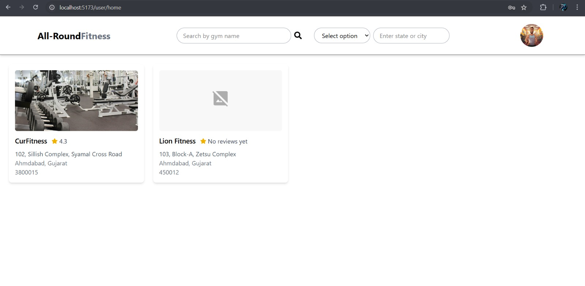
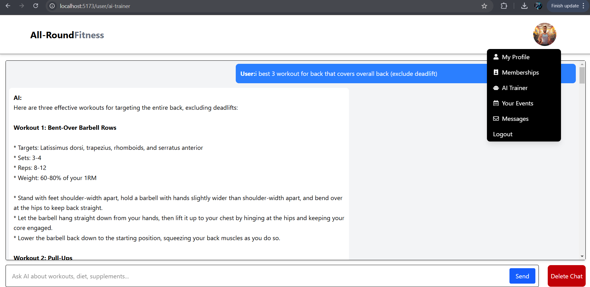
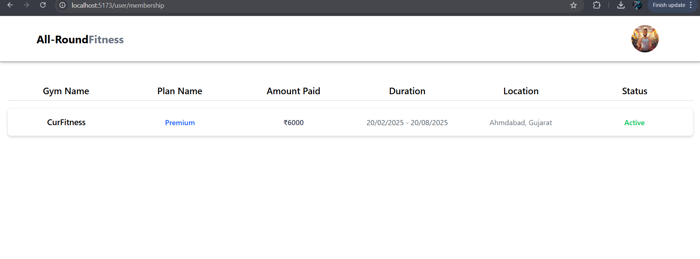
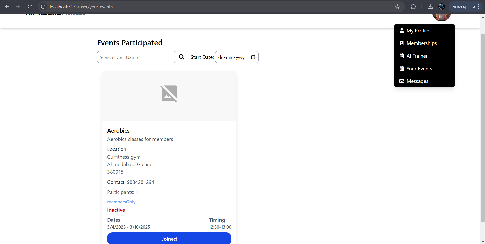
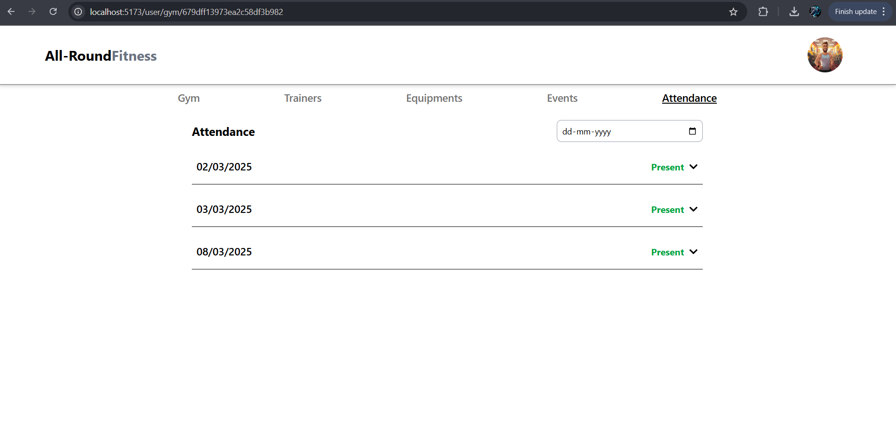
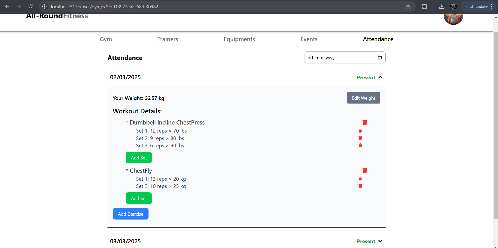
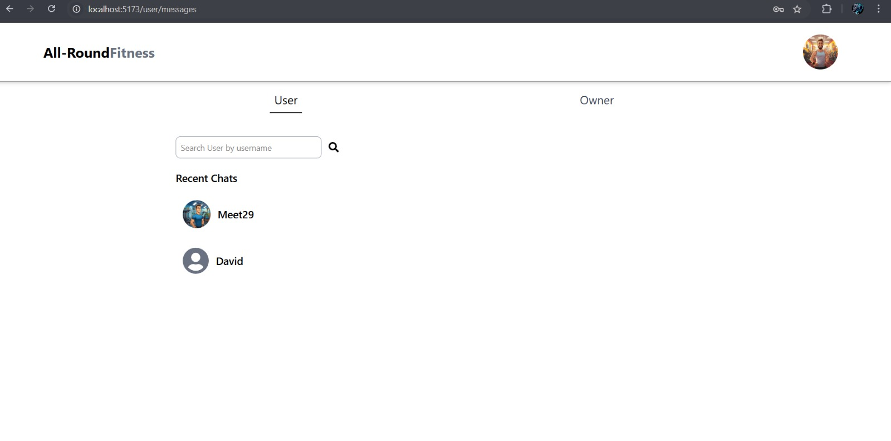

<h3>Owner</h3>
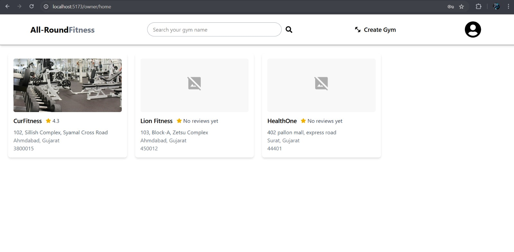
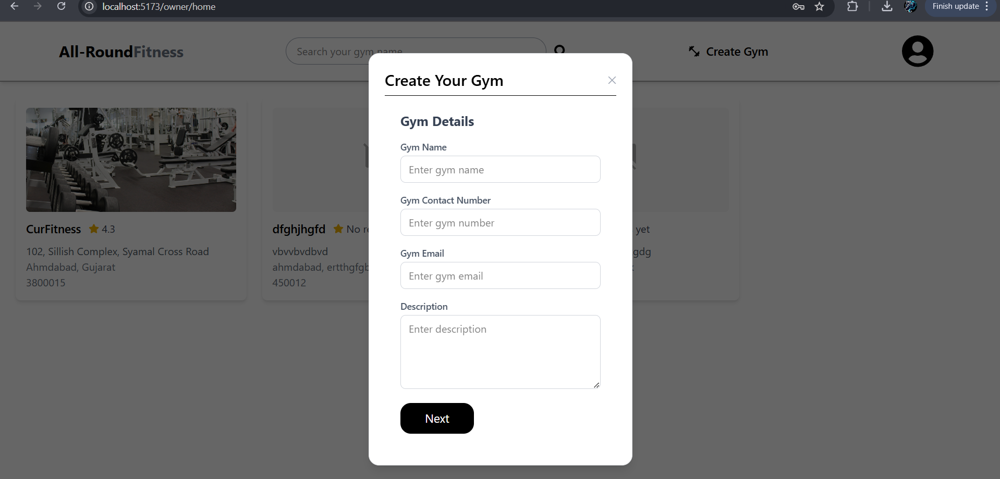
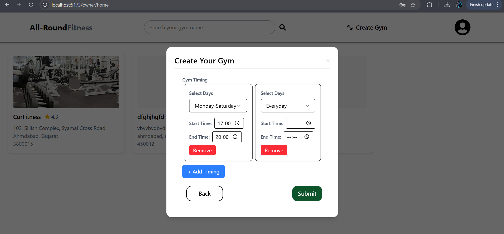
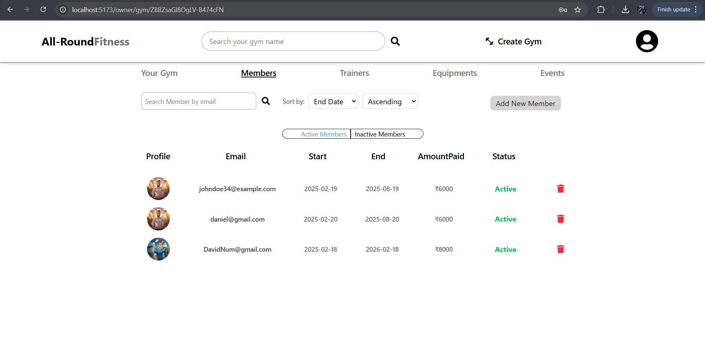
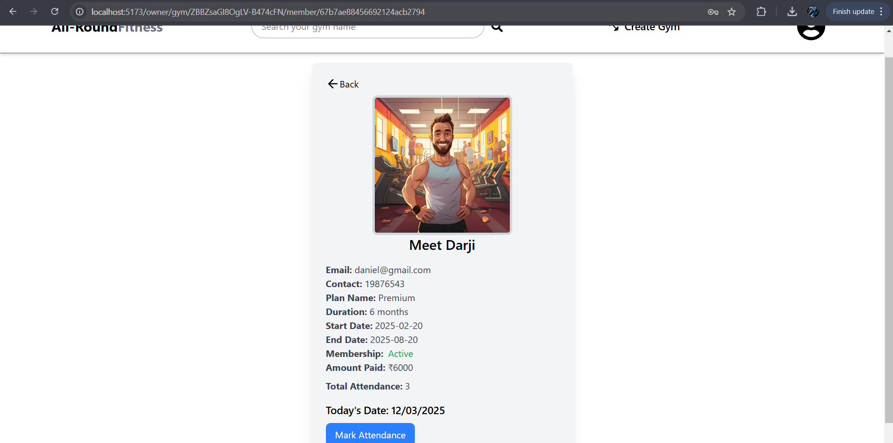

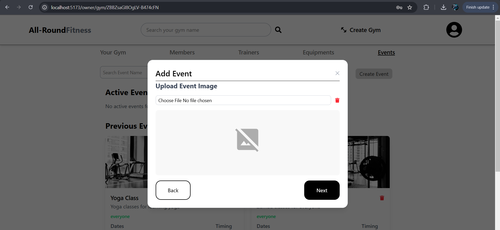
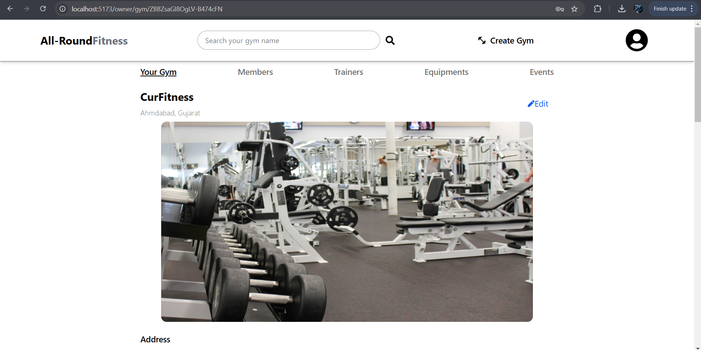
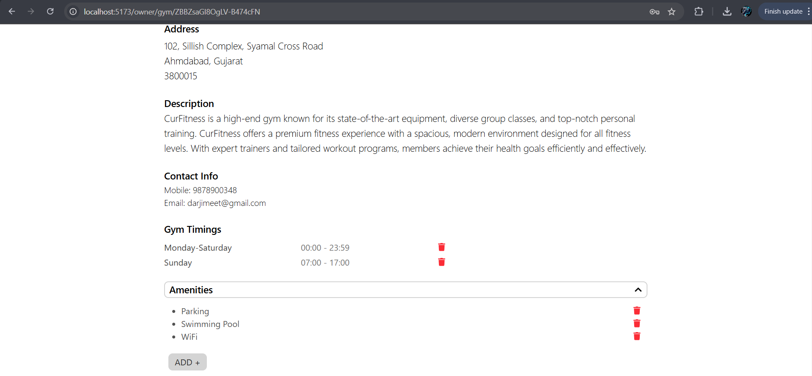
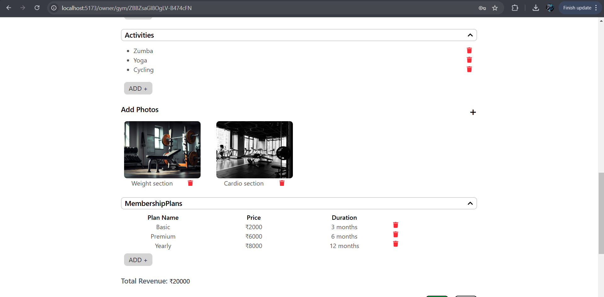
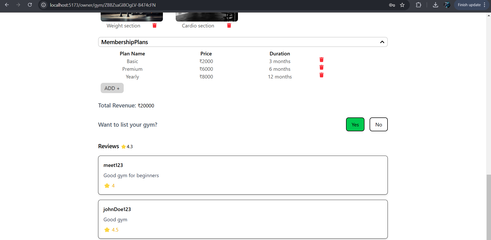

<h2>Features</h2>
<h3>Owner Module</h3>
<ul>
    <li><strong>Create and Manage Gym:</strong> Owners can register their gym, update details, and manage operations.</li>
    <li><strong>Manage Trainers:</strong> Add, edit, or remove trainers and assign them to specific gyms.</li>
    <li><strong>Create Events:</strong> Organize and promote gym-related events.</li>
    <li><strong>Messaging System:</strong> Send messages to gym members, other users, and even other gym owners.</li>
    <li><strong>List Gym:</strong> Display their gym in the marketplace for users to explore and join.</li>
</ul>

<h3>User Module</h3>
<ul>
    <li><strong>User Authentication:</strong> Secure login system for users.</li>
    <li><strong>Explore Listed Gyms:</strong> Browse and search for available gyms.</li>
    <li><strong>Purchase Membership:</strong> Users can buy memberships for a specific gym.</li>
    <li><strong>Join Events:</strong> Participate in gym-hosted events.</li>
    <li><strong>Chat with AI Trainer:</strong> Get virtual fitness guidance from an AI-based trainer.</li>
    <li><strong>Track Attendance & Workouts:</strong> View their attendance and track workouts for specific dates.</li>
    <li><strong>Social Interaction:</strong> Chat with other users and gym owners.</li>
</ul>

<h2>Technology Stack</h2>
<ul>
    <li><strong>Frontend:</strong> React.js  (for UI and interactions)</li>
    <li><strong>Backend:</strong> Node.js / Express.js  (for API and database management)</li>
    <li><strong>Database:</strong> MongoDB  (to store users, gyms, and memberships data)</li>
    <li><strong>Authentication:</strong> JWT  for secure login</li>
    <li><strong>AI Trainer:</strong>Integrate llama3.2 from ollama which needs to be install on system</li>
    <li><strong>Messaging:</strong> WebSockets for real-time chat</li>
</ul>
<h2>Ollama Installation</h2>

To use the AI trainer feature, you need to install Ollama on your system. You can find the installation guide and download links here: <a href="https://ollama.com" target="_blank">Ollama Official Website</a> and needs to run llama3.2.

<h2>
    Note: ScreenShots of this website are uploaded in fitnessImages folder
</h2>
